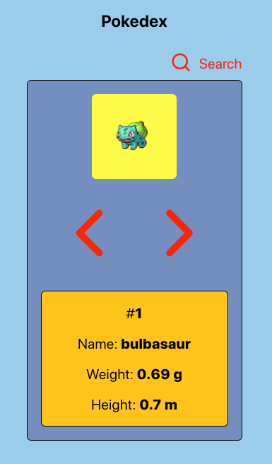

# Pokedex



### Live Site

[https://theo333.github.io/pokedex/#/](https://theo333.github.io/pokedex/#/)

### Description

Pokedex is an app which allows a user to get info on individual Pokemon from the PokeAPI. Also enables them to search for a Pokemon by name.

### Functionality

This application enables the user to:

- Scroll through Pokemon in a Pokedex
- Search for a Pokemon by name

## To Run Locally

Clone repo to your computer

Install

```
npm i
```

Run Program

```
npm run start
```

Open site in browser.

`http://localhost:3000/#/`
